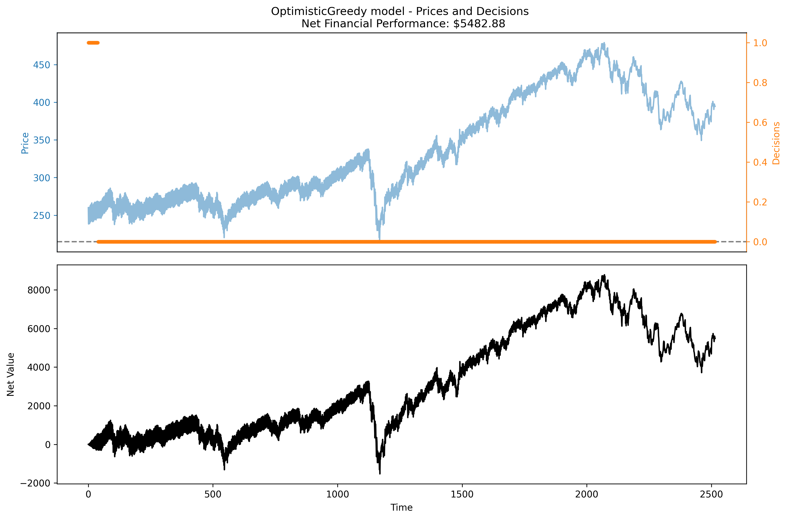
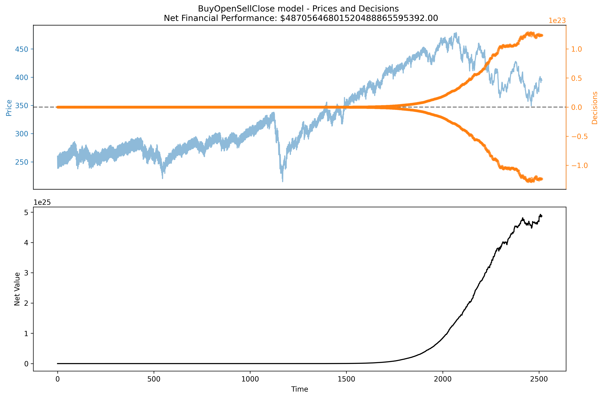
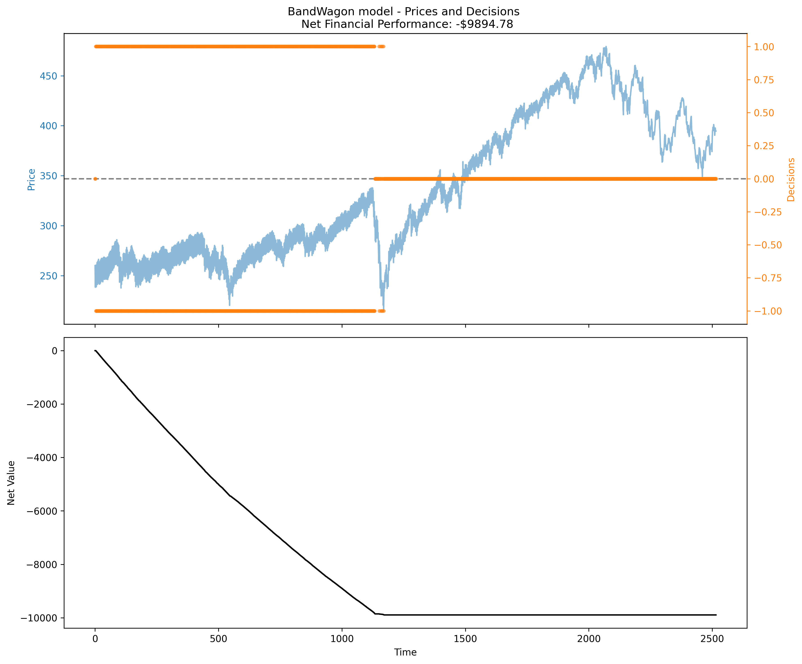
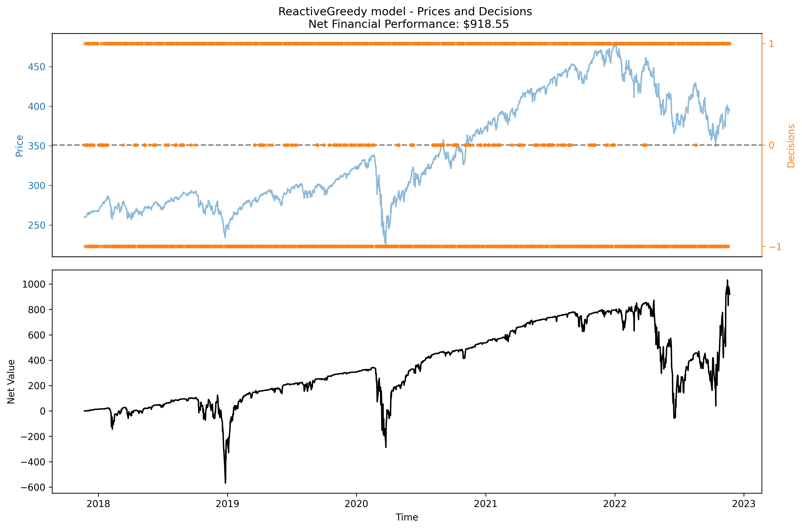
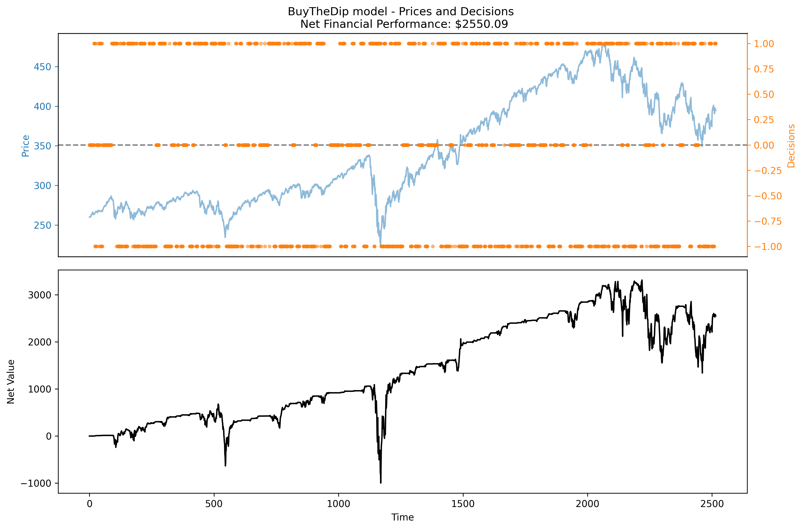
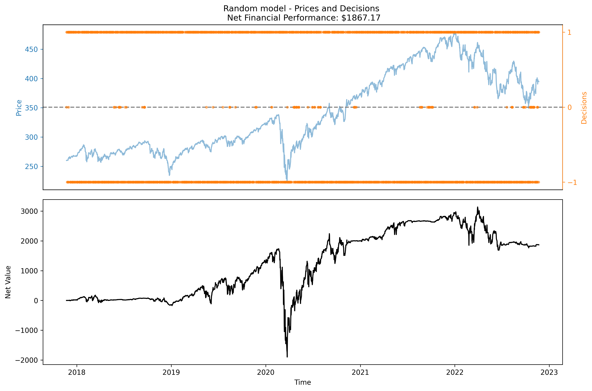
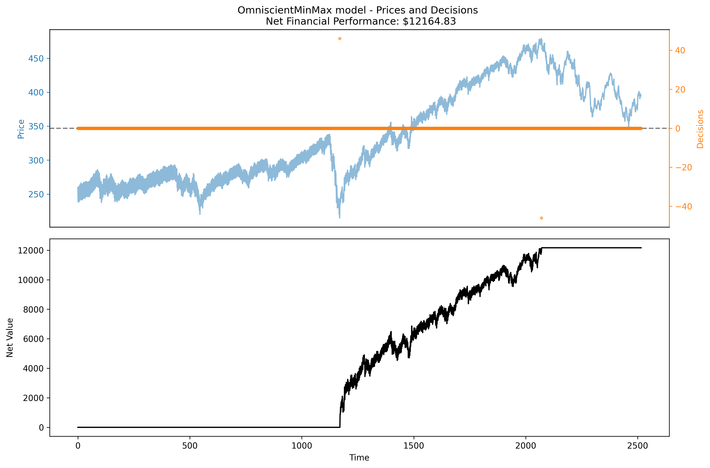
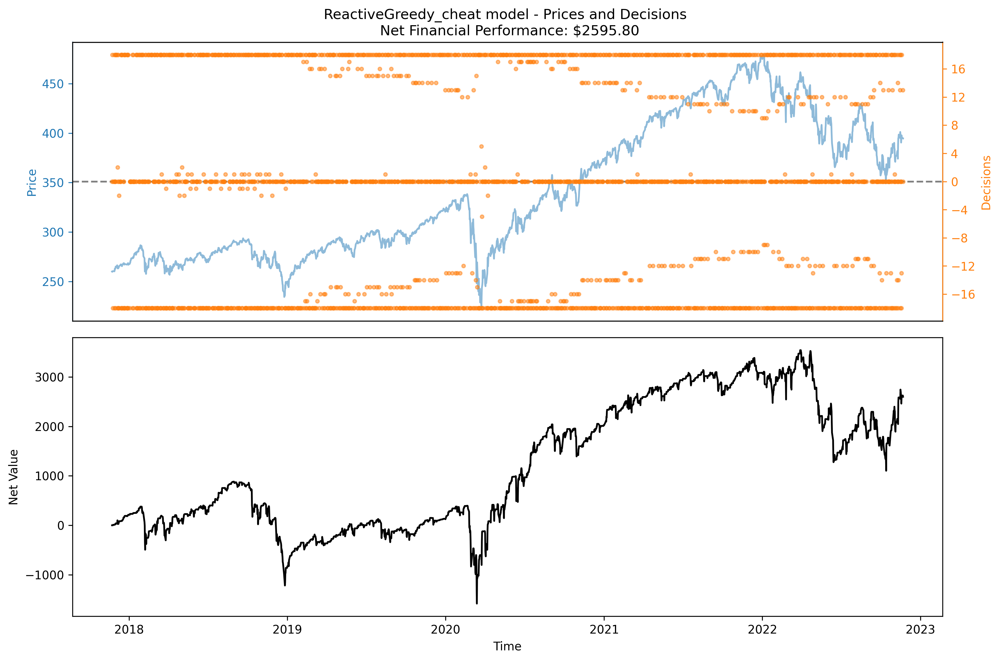

## Simple Models

* LongHaul - Buy as many shares a possible on the first iteration and never sell.

* OptimisticGreedy: Always buy exactly one share per iteration (this ends up being very similar to the LongHaul model, it just takes a little longer to spend all of its money)

* BuyOpenSellClose - Buy as many shares as possible each morning and sell all each evening.

* BuyCloseSellOpen - Sell all shares each morning and buy as many as possible each evening.

* BandWagon - This is a "Momentum" based model: Buy one share if the current price is greater than the previous, sell one if less, and do nothing if equal.

* ReactiveGreedy - This is a "Reverse Momentum" model using just the last two points. the opposite of the BandWagon model; buy if current is greater than previous, etc.

* BuyTheDip - This is another "Reverse Momentum" model, using a ten point interval. If the current price is lower than the price nine points previously, it will buy a share; if it's higher it will sell a share; and if it's equal it will do nothing.

* Random: Randomly choose to buy or sell one share per time period. This is a reference model, to give a sense of how each strategy compares to blind guesswork.

* OmniscientMinMax: This is not strictly a valid model (also not truly greedy); it is a refernece model that uses special knowledge to buy as many shares as possible at the global minimum and sell all of its shares at the global maximum. So far it outperforms all our other models, so perhaps it is useful as a provisional upper bound on financial performance.

## "Cheat" Models

Since we are only using a single time series, all of our models are indirectly "trained" on "test" data (i.e. any manual adjustments to improve performance are tainted by prescience, a sort of cheat, that could lead to overfitting => loss of generality). For some of our models, we tried parameterizing them and scanning the parameter space for optimal parameters:

* ReactiveGreedy_cheat: This model uses the same logic as ReactiveGreedy (i.e. buying or selling based on negative/positive slope for last two points, respectively) but instead of simply buying/selling exactly one share for each transaction, we tried using other constants. For example we might always try to buy/sell exactly 10 shares. By brute force we determined that, for this data set and initial budget of $10,000, the optimal number of shares was 18, yielding ~43% net value USD over ~3.5 years.

