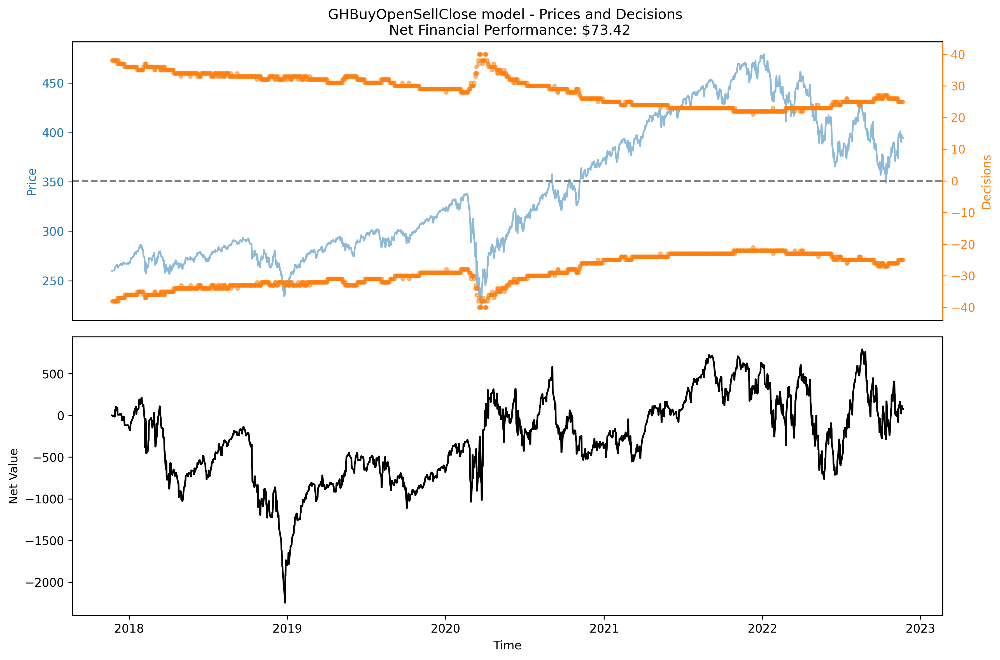
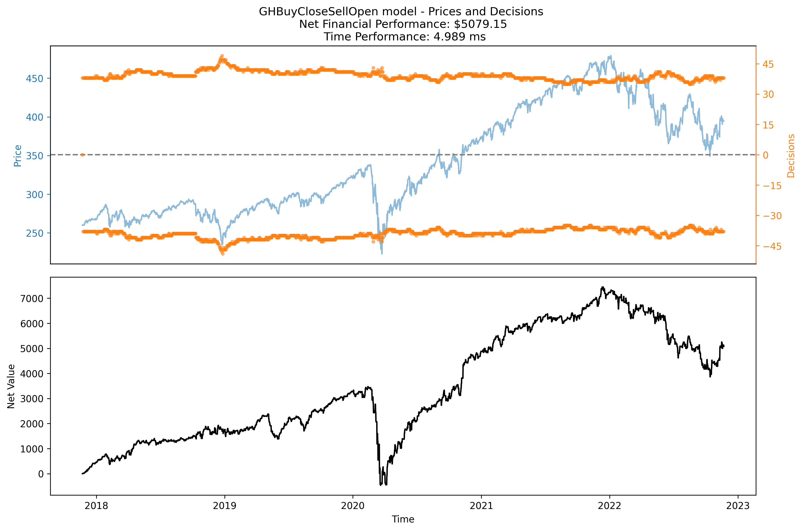
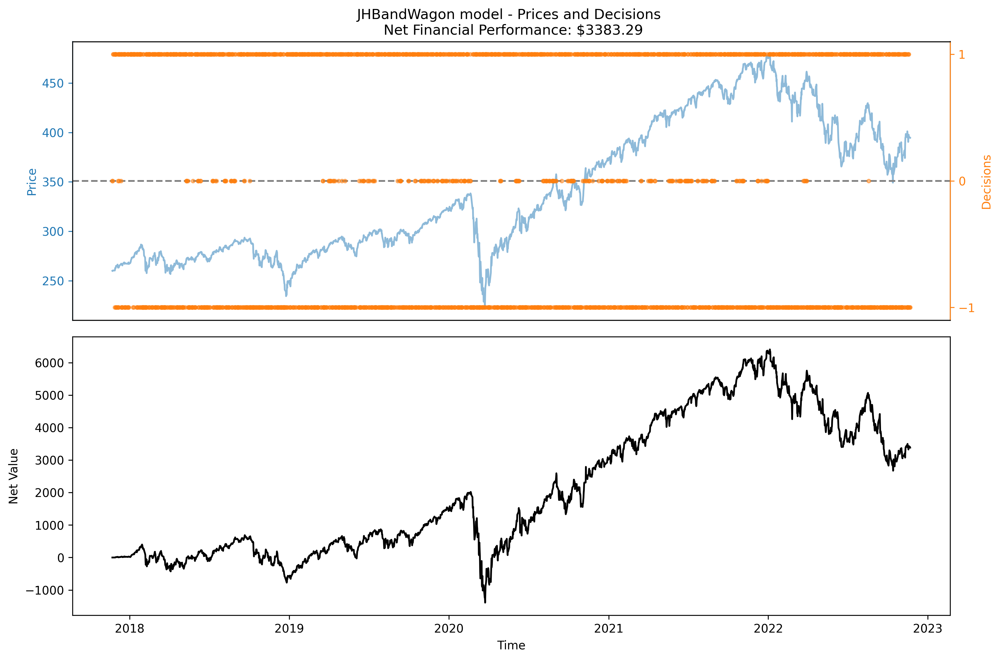
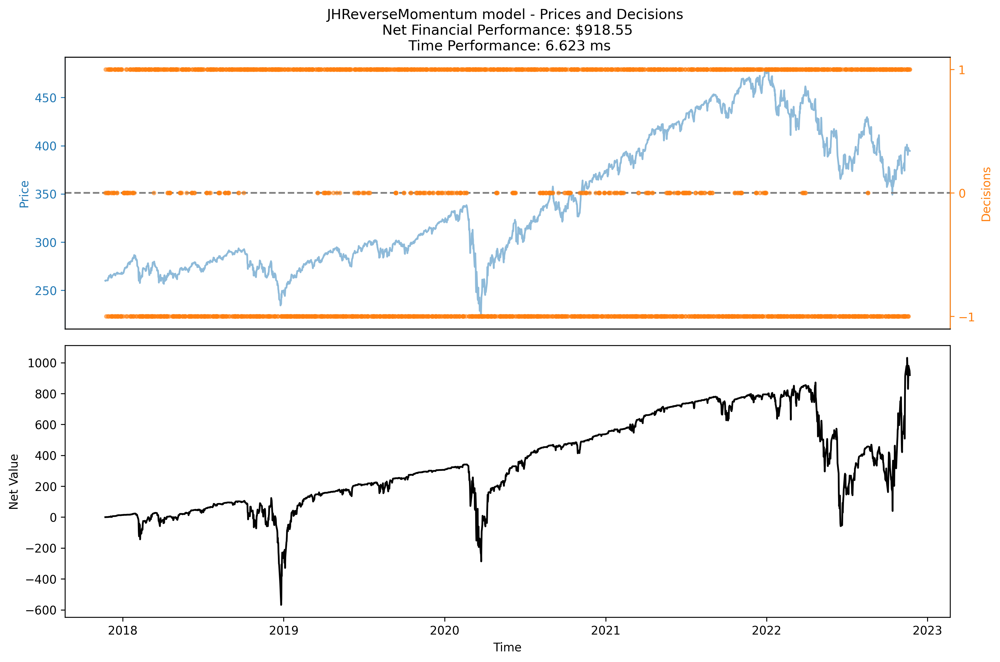
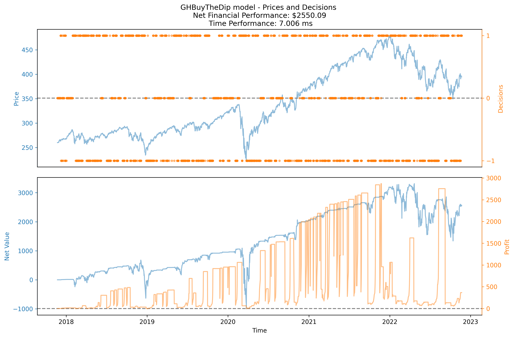
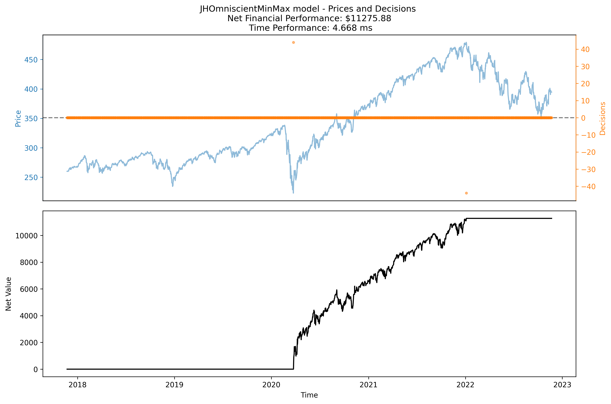
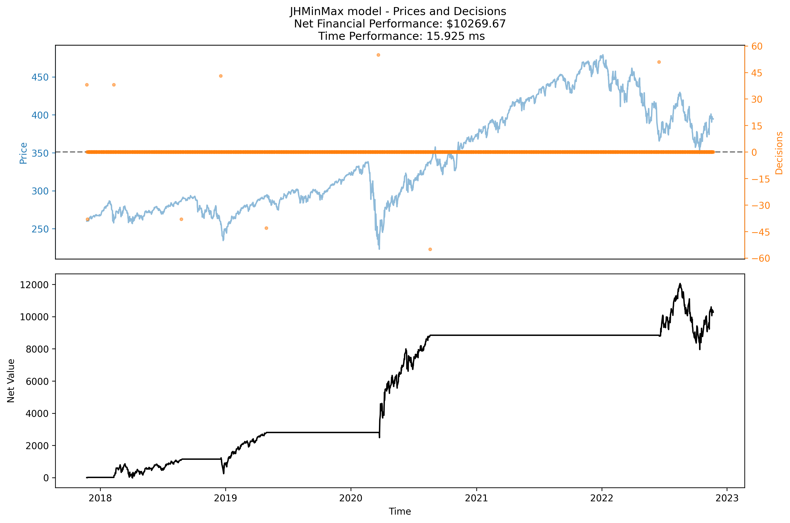
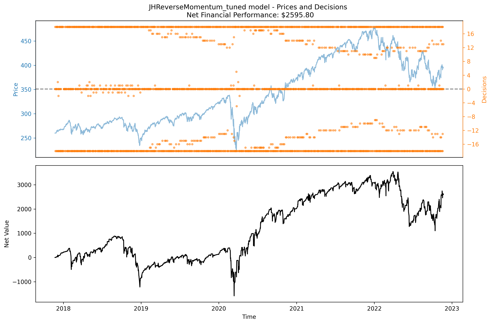
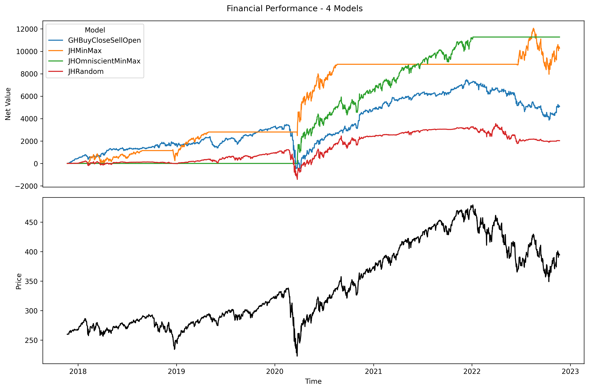
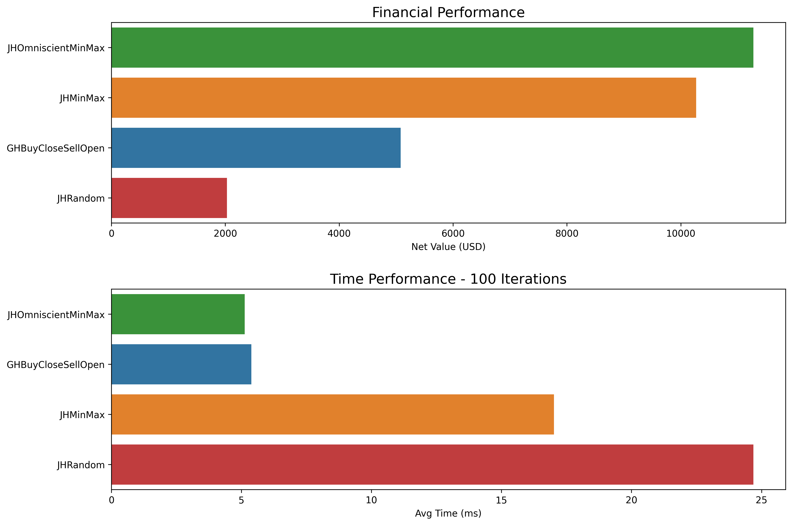

## Simple Models

* JHLongHaul - Buy as many shares a possible on the first iteration and never sell.

* GHBuyOpenSellClose - Buy as many shares as possible each morning and sell all each evening.

* GHBuyCloseSellOpen - Sell all shares each morning and buy as many as possible each evening.

* JHBandWagon - This is a "Momentum" based model, based on the last two points:
  * Buy one share if the current price is greater than the previous
  * Sell one if less
  * Do nothing if equal

* JHReverseMomentum - This is an immediate "Reverse Momentum" model (i.e. the opposite of the JHBandWagon model):
  * Buy if current price is less than previous
  * Sell if current is greater than previous
  * Do nothing if last two prices are equal

* GHBuyTheDip - This is another "Reverse Momentum" model, using a ten point lag:
  * If the current price is lower than the price nine points previously, buy a share
  * If it's higher, sell a share
  * If it's equal it will do nothing

* JHRandomProp: Randomly choose to buy, sell, or hold. When buying and selling, this model will buy or sell as much as it can at that time. This is a reference model, to give a sense of how each strategy compares to blind guesswork.

* JHOmniscientMinMax: This is not strictly a valid model (also not truly greedy); it is a refernece model that uses special knowledge to buy as many shares as possible at the global minimum and sell all of its shares at the global maximum. So far it outperforms all our other models, so perhaps it is useful as a provisional upper bound on financial performance.

* JHMinMax: This is based on the JHOmniscientMinMax model, but uses a rolling min/max over the previous 728 points (about a year) of historic data.

## "Tuned" Models

Since we are only working with a single time series, all of our models are indirectly "trained" on "test" data (i.e. any manual adjustments to improve performance are tainted by prescience, which could lead to overfitting => loss of generality). For some of our models, we tried parameterizing them and scanning the parameter space for optimal parameters:

* JHReverseMomentum_tuned: This model uses the same logic as JHReverseMomentum (i.e. buying or selling based on negative/positive slope for last two points, respectively) but instead of simply buying/selling exactly one share for each transaction, we tried using other constants. For example we might always try to buy/sell exactly 10 shares. By brute force we determined that, for this data set and initial budget of $10,000, the optimal number of shares was 18, yielding ~43% net value USD over ~3.5 years.

## Comparing Models

